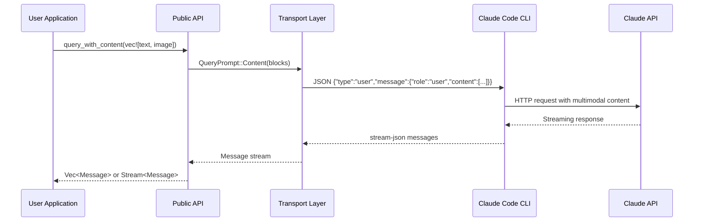

# Technical Design: Support Image Input in User Prompts

**Version**: 1.0
**Date**: 2026-01-03
**Author**: System Architect Agent
**Status**: Draft

---

## 1. Executive Summary

### Overview
This design adds multimodal image input support to the Claude Agent SDK for Rust, enabling users to include images alongside text in their prompts. The implementation follows existing SDK patterns, maintains backward compatibility, and provides an ergonomic API for both one-shot queries and bidirectional streaming.

### Key Decisions
1. **Separate User Input Types**: Create `UserContentBlock` enum specifically for user prompt construction, distinct from the response-oriented `ContentBlock` enum
2. **Additive API Changes**: Introduce `*_with_content()` variants rather than modifying existing function signatures
3. **Transport Layer Extension**: Extend `QueryPrompt` enum to support structured content blocks for proper CLI serialization
4. **Builder Pattern for Ergonomics**: Provide helper methods (`::text()`, `::image_base64()`, `::image_url()`) for convenient content block construction

### Implementation Scope
- **Estimated Effort**: 2-3 days
- **Risk Level**: Low (additive changes, no breaking modifications)
- **Test Coverage**: Unit tests for serialization, integration tests for end-to-end image queries

---

## 2. System Architecture

### Architecture Overview

```
┌─────────────────────────────────────────────────────────────────────┐
│                         User Application                             │
├─────────────────────────────────────────────────────────────────────┤
│  query_with_content()  │  query_stream_with_content()  │            │
│  ClaudeClient::query_with_content()                     │            │
├─────────────────────────────────────────────────────────────────────┤
│                     Public API Layer (lib.rs)                        │
│  Exports: UserContentBlock, ImageSource, ImageBlock                  │
├─────────────────────────────────────────────────────────────────────┤
│                     Query Layer (query.rs)                           │
│  Converts Vec<UserContentBlock> → QueryPrompt::Content              │
├─────────────────────────────────────────────────────────────────────┤
│                     Client Layer (client.rs)                         │
│  Serializes content blocks to JSON for stdin                        │
├─────────────────────────────────────────────────────────────────────┤
│                   Transport Layer (subprocess.rs)                    │
│  QueryPrompt::Content → JSON serialization for CLI                  │
├─────────────────────────────────────────────────────────────────────┤
│                      Claude Code CLI                                 │
│  Receives stream-json formatted messages with image content         │
└─────────────────────────────────────────────────────────────────────┘
```

### Data Flow



---

## 3. Component Specifications

### 3.1 New Types in `src/types/messages.rs`

#### ImageSource Enum

```rust
/// Image source for user prompts
///
/// Represents the source of image data that can be included in user messages.
/// Claude supports both base64-encoded images and URL references.
///
/// # Supported Formats
///
/// - JPEG (`image/jpeg`)
/// - PNG (`image/png`)
/// - GIF (`image/gif`)
/// - WebP (`image/webp`)
///
/// # Examples
///
/// ```rust
/// use claude_agent_sdk_rs::ImageSource;
///
/// // Base64-encoded image
/// let source = ImageSource::Base64 {
///     media_type: "image/png".to_string(),
///     data: base64_encoded_data,
/// };
///
/// // URL reference
/// let source = ImageSource::Url {
///     url: "https://example.com/image.png".to_string(),
/// };
/// ```
#[derive(Debug, Clone, Serialize, Deserialize, PartialEq)]
#[serde(tag = "type", rename_all = "snake_case")]
pub enum ImageSource {
    /// Base64-encoded image data
    Base64 {
        /// MIME type (e.g., "image/png", "image/jpeg", "image/gif", "image/webp")
        media_type: String,
        /// Base64-encoded image data (without data URI prefix)
        data: String,
    },
    /// URL reference to an image
    Url {
        /// Publicly accessible image URL
        url: String,
    },
}
```

**Serialization Output**:
```json
// Base64 variant
{"type": "base64", "media_type": "image/png", "data": "iVBORw0KGgo..."}

// URL variant
{"type": "url", "url": "https://example.com/image.png"}
```

#### ImageBlock Struct

```rust
/// Image block for user prompts
///
/// A content block containing image data. This is used within `UserContentBlock`
/// to include images in user messages.
#[derive(Debug, Clone, Serialize, Deserialize, PartialEq)]
pub struct ImageBlock {
    /// Image source (base64 or URL)
    pub source: ImageSource,
}
```

#### UserContentBlock Enum

```rust
/// Content block for user prompts (input)
///
/// Represents content that can be included in user messages. Unlike `ContentBlock`
/// which is used for parsing assistant responses, `UserContentBlock` is designed
/// for constructing user input with proper serialization.
///
/// # Examples
///
/// ```rust
/// use claude_agent_sdk_rs::UserContentBlock;
///
/// // Using builder methods
/// let blocks = vec![
///     UserContentBlock::text("What's in this image?"),
///     UserContentBlock::image_base64("image/png", base64_data),
/// ];
///
/// // Using struct variants directly
/// let blocks = vec![
///     UserContentBlock::Text { text: "Describe this".to_string() },
///     UserContentBlock::Image {
///         source: ImageSource::Url { url: "https://...".to_string() },
///     },
/// ];
/// ```
#[derive(Debug, Clone, Serialize, Deserialize, PartialEq)]
#[serde(tag = "type", rename_all = "snake_case")]
pub enum UserContentBlock {
    /// Text content
    Text {
        /// The text content
        text: String,
    },
    /// Image content
    Image {
        /// Image source
        source: ImageSource,
    },
}
```

**Serialization Output**:
```json
// Text block
{"type": "text", "text": "What is in this image?"}

// Image block with base64
{"type": "image", "source": {"type": "base64", "media_type": "image/png", "data": "..."}}

// Image block with URL
{"type": "image", "source": {"type": "url", "url": "https://..."}}
```

#### Builder Methods

```rust
impl UserContentBlock {
    /// Create a text content block
    ///
    /// # Examples
    ///
    /// ```rust
    /// let block = UserContentBlock::text("Hello, Claude!");
    /// ```
    pub fn text(text: impl Into<String>) -> Self {
        UserContentBlock::Text { text: text.into() }
    }

    /// Create an image content block from base64 data
    ///
    /// # Arguments
    ///
    /// * `media_type` - MIME type (e.g., "image/png", "image/jpeg")
    /// * `data` - Base64-encoded image data (without data URI prefix)
    ///
    /// # Examples
    ///
    /// ```rust
    /// use std::fs;
    /// use base64::Engine;
    ///
    /// let image_bytes = fs::read("screenshot.png")?;
    /// let base64_data = base64::engine::general_purpose::STANDARD.encode(&image_bytes);
    /// let block = UserContentBlock::image_base64("image/png", base64_data);
    /// ```
    pub fn image_base64(media_type: impl Into<String>, data: impl Into<String>) -> Self {
        UserContentBlock::Image {
            source: ImageSource::Base64 {
                media_type: media_type.into(),
                data: data.into(),
            },
        }
    }

    /// Create an image content block from URL
    ///
    /// # Arguments
    ///
    /// * `url` - Publicly accessible URL to the image
    ///
    /// # Examples
    ///
    /// ```rust
    /// let block = UserContentBlock::image_url("https://example.com/diagram.png");
    /// ```
    pub fn image_url(url: impl Into<String>) -> Self {
        UserContentBlock::Image {
            source: ImageSource::Url { url: url.into() },
        }
    }
}
```

#### From Implementations for Backward Compatibility

```rust
impl From<String> for UserContentBlock {
    fn from(text: String) -> Self {
        UserContentBlock::Text { text }
    }
}

impl From<&str> for UserContentBlock {
    fn from(text: &str) -> Self {
        UserContentBlock::Text { text: text.to_string() }
    }
}
```

#### Update ContentBlock Enum (Response Parsing)

Add `Image` variant to handle image blocks in assistant responses:

```rust
#[derive(Debug, Clone, Serialize, Deserialize)]
#[serde(tag = "type", rename_all = "snake_case")]
pub enum ContentBlock {
    /// Text block
    Text(TextBlock),
    /// Image block (for responses containing images)
    Image(ImageBlock),
    /// Thinking block (extended thinking)
    Thinking(ThinkingBlock),
    /// Tool use block
    ToolUse(ToolUseBlock),
    /// Tool result block
    ToolResult(ToolResultBlock),
}
```

---

### 3.2 Transport Layer Changes in `src/internal/transport/subprocess.rs`

#### Extend QueryPrompt Enum

```rust
/// Query prompt type
#[derive(Clone)]
pub enum QueryPrompt {
    /// Text prompt (one-shot mode)
    Text(String),
    /// Content blocks prompt (multimodal mode)
    Content(Vec<UserContentBlock>),
    /// Streaming mode (no initial prompt)
    Streaming,
}

impl From<Vec<UserContentBlock>> for QueryPrompt {
    fn from(blocks: Vec<UserContentBlock>) -> Self {
        QueryPrompt::Content(blocks)
    }
}
```

#### Update connect() Method

Modify the `connect()` method to handle `QueryPrompt::Content`:

```rust
// In connect() method, update the initial prompt sending logic:
match &self.prompt {
    QueryPrompt::Text(text) => {
        let text_owned = text.clone();
        self.write(&text_owned).await?;
        self.end_input().await?;
    }
    QueryPrompt::Content(blocks) => {
        // Serialize content blocks as JSON array
        let content_json = serde_json::to_string(blocks).map_err(|e| {
            ClaudeError::Transport(format!("Failed to serialize content blocks: {}", e))
        })?;
        self.write(&content_json).await?;
        self.end_input().await?;
    }
    QueryPrompt::Streaming => {
        // Don't send initial prompt or close stdin - leave it open for streaming
    }
}
```

**Note**: The CLI expects the prompt to be sent directly when not using `--input-format stream-json`. For content blocks, we serialize the `Vec<UserContentBlock>` as a JSON array which the CLI will parse as multimodal content.

---

### 3.3 Query Functions in `src/query.rs`

#### Add query_with_content()

```rust
/// Query Claude Code with structured content blocks (supports images)
///
/// This function enables multimodal queries where you can include images
/// alongside text in your prompt. It's ideal for vision-related tasks
/// like image analysis, diagram interpretation, or screenshot understanding.
///
/// # Arguments
///
/// * `content` - A vector of content blocks (text and/or images)
/// * `options` - Optional configuration for the query
///
/// # Examples
///
/// ```no_run
/// use claude_agent_sdk_rs::{query_with_content, UserContentBlock, Message, ContentBlock};
/// use std::fs;
/// use base64::Engine;
///
/// #[tokio::main]
/// async fn main() -> anyhow::Result<()> {
///     // Read and encode image
///     let image_data = fs::read("screenshot.png")?;
///     let base64_data = base64::engine::general_purpose::STANDARD.encode(&image_data);
///
///     // Query with text and image
///     let messages = query_with_content(vec![
///         UserContentBlock::text("What's shown in this screenshot?"),
///         UserContentBlock::image_base64("image/png", base64_data),
///     ], None).await?;
///
///     for message in messages {
///         if let Message::Assistant(msg) = message {
///             for block in &msg.message.content {
///                 if let ContentBlock::Text(text) = block {
///                     println!("Claude: {}", text.text);
///                 }
///             }
///         }
///     }
///
///     Ok(())
/// }
/// ```
pub async fn query_with_content(
    content: impl Into<Vec<UserContentBlock>>,
    options: Option<ClaudeAgentOptions>,
) -> Result<Vec<Message>> {
    let query_prompt = QueryPrompt::Content(content.into());
    let opts = options.unwrap_or_default();

    let client = InternalClient::new(query_prompt, opts)?;
    client.execute().await
}
```

#### Add query_stream_with_content()

```rust
/// Query Claude Code with streaming and structured content blocks
///
/// Similar to `query_with_content()` but returns a stream for memory-efficient
/// processing of responses. Use this when you need real-time message processing
/// or when dealing with potentially large responses.
///
/// # Arguments
///
/// * `content` - A vector of content blocks (text and/or images)
/// * `options` - Optional configuration for the query
///
/// # Examples
///
/// ```no_run
/// use claude_agent_sdk_rs::{query_stream_with_content, UserContentBlock, Message, ContentBlock};
/// use futures::stream::StreamExt;
///
/// #[tokio::main]
/// async fn main() -> anyhow::Result<()> {
///     let mut stream = query_stream_with_content(vec![
///         UserContentBlock::text("Describe this image"),
///         UserContentBlock::image_url("https://example.com/photo.jpg"),
///     ], None).await?;
///
///     while let Some(result) = stream.next().await {
///         match result? {
///             Message::Assistant(msg) => {
///                 for block in &msg.message.content {
///                     if let ContentBlock::Text(text) = block {
///                         print!("{}", text.text);
///                     }
///                 }
///             }
///             _ => {}
///         }
///     }
///
///     Ok(())
/// }
/// ```
pub async fn query_stream_with_content(
    content: impl Into<Vec<UserContentBlock>>,
    options: Option<ClaudeAgentOptions>,
) -> Result<Pin<Box<dyn Stream<Item = Result<Message>> + Send>>> {
    let query_prompt = QueryPrompt::Content(content.into());
    let opts = options.unwrap_or_default();

    let mut transport = SubprocessTransport::new(query_prompt, opts)?;
    transport.connect().await?;

    let stream = async_stream::stream! {
        let mut message_stream = transport.read_messages();
        while let Some(json_result) = message_stream.next().await {
            match json_result {
                Ok(json) => {
                    match MessageParser::parse(json) {
                        Ok(message) => yield Ok(message),
                        Err(e) => {
                            yield Err(e);
                            break;
                        }
                    }
                }
                Err(e) => {
                    yield Err(e);
                    break;
                }
            }
        }
    };

    Ok(Box::pin(stream))
}
```

---

### 3.4 Client Methods in `src/client.rs`

#### Add query_with_content()

```rust
/// Send a query with structured content blocks (supports images)
///
/// This method enables multimodal queries in bidirectional streaming mode.
/// Use it to send images alongside text for vision-related tasks.
///
/// # Arguments
///
/// * `content` - A vector of content blocks (text and/or images)
///
/// # Errors
///
/// Returns an error if the client is not connected or if sending fails.
///
/// # Examples
///
/// ```no_run
/// # use claude_agent_sdk_rs::{ClaudeClient, ClaudeAgentOptions, UserContentBlock};
/// # #[tokio::main]
/// # async fn main() -> Result<(), Box<dyn std::error::Error>> {
/// # let mut client = ClaudeClient::new(ClaudeAgentOptions::default());
/// # client.connect().await?;
/// client.query_with_content(vec![
///     UserContentBlock::text("What's in this image?"),
///     UserContentBlock::image_base64("image/png", base64_data),
/// ]).await?;
/// # Ok(())
/// # }
/// ```
pub async fn query_with_content(
    &mut self,
    content: impl Into<Vec<UserContentBlock>>,
) -> Result<()> {
    self.query_with_content_and_session(content, "default").await
}
```

#### Add query_with_content_and_session()

```rust
/// Send a query with structured content blocks and a specific session ID
///
/// This method enables multimodal queries with session management for
/// maintaining separate conversation contexts.
///
/// # Arguments
///
/// * `content` - A vector of content blocks (text and/or images)
/// * `session_id` - Session identifier for the conversation
///
/// # Errors
///
/// Returns an error if the client is not connected or if sending fails.
///
/// # Examples
///
/// ```no_run
/// # use claude_agent_sdk_rs::{ClaudeClient, ClaudeAgentOptions, UserContentBlock};
/// # #[tokio::main]
/// # async fn main() -> Result<(), Box<dyn std::error::Error>> {
/// # let mut client = ClaudeClient::new(ClaudeAgentOptions::default());
/// # client.connect().await?;
/// client.query_with_content_and_session(
///     vec![
///         UserContentBlock::text("Analyze this chart"),
///         UserContentBlock::image_url("https://example.com/chart.png"),
///     ],
///     "analysis-session",
/// ).await?;
/// # Ok(())
/// # }
/// ```
pub async fn query_with_content_and_session(
    &mut self,
    content: impl Into<Vec<UserContentBlock>>,
    session_id: impl Into<String>,
) -> Result<()> {
    let query = self.query.as_ref().ok_or_else(|| {
        ClaudeError::InvalidConfig("Client not connected. Call connect() first.".to_string())
    })?;

    let content_blocks: Vec<UserContentBlock> = content.into();
    let session_id_str = session_id.into();

    // Format as JSON message for stream-json input format
    // Content is an array of content blocks, not a simple string
    let user_message = serde_json::json!({
        "type": "user",
        "message": {
            "role": "user",
            "content": content_blocks
        },
        "session_id": session_id_str
    });

    let message_str = serde_json::to_string(&user_message).map_err(|e| {
        ClaudeError::Transport(format!("Failed to serialize user message: {}", e))
    })?;

    // Write directly to stdin (bypasses transport lock)
    let query_guard = query.lock().await;
    let stdin = query_guard.stdin.clone();
    drop(query_guard);

    if let Some(stdin_arc) = stdin {
        let mut stdin_guard = stdin_arc.lock().await;
        if let Some(ref mut stdin_stream) = *stdin_guard {
            stdin_stream
                .write_all(message_str.as_bytes())
                .await
                .map_err(|e| ClaudeError::Transport(format!("Failed to write query: {}", e)))?;
            stdin_stream.write_all(b"\n").await.map_err(|e| {
                ClaudeError::Transport(format!("Failed to write newline: {}", e))
            })?;
            stdin_stream
                .flush()
                .await
                .map_err(|e| ClaudeError::Transport(format!("Failed to flush: {}", e)))?;
        } else {
            return Err(ClaudeError::Transport("stdin not available".to_string()));
        }
    } else {
        return Err(ClaudeError::Transport("stdin not set".to_string()));
    }

    Ok(())
}
```

---

### 3.5 Public Exports in `src/lib.rs`

Add exports for new types:

```rust
// In the re-exports section, add:
pub use types::messages::{
    // Existing exports...
    ImageSource,
    ImageBlock,
    UserContentBlock,
};

// In the query re-exports, add:
pub use query::{query, query_stream, query_with_content, query_stream_with_content};
```

---

## 4. API Specification

### 4.1 Public Functions

| Function | Parameters | Return Type | Description |
|----------|------------|-------------|-------------|
| `query_with_content` | `content: impl Into<Vec<UserContentBlock>>`, `options: Option<ClaudeAgentOptions>` | `Result<Vec<Message>>` | One-shot multimodal query |
| `query_stream_with_content` | `content: impl Into<Vec<UserContentBlock>>`, `options: Option<ClaudeAgentOptions>` | `Result<Pin<Box<dyn Stream<Item = Result<Message>> + Send>>>` | Streaming multimodal query |

### 4.2 ClaudeClient Methods

| Method | Parameters | Return Type | Description |
|--------|------------|-------------|-------------|
| `query_with_content` | `content: impl Into<Vec<UserContentBlock>>` | `Result<()>` | Send multimodal query |
| `query_with_content_and_session` | `content: impl Into<Vec<UserContentBlock>>`, `session_id: impl Into<String>` | `Result<()>` | Send multimodal query with session |

### 4.3 Type Constructors

| Type | Constructor | Parameters | Description |
|------|-------------|------------|-------------|
| `UserContentBlock` | `::text()` | `text: impl Into<String>` | Create text block |
| `UserContentBlock` | `::image_base64()` | `media_type: impl Into<String>`, `data: impl Into<String>` | Create base64 image block |
| `UserContentBlock` | `::image_url()` | `url: impl Into<String>` | Create URL image block |

---

## 5. Database Schema

Not applicable - this feature does not involve database changes.

---

## 6. Serialization Format

### 6.1 One-Shot Mode (QueryPrompt::Content)

When using `query_with_content()`, the content blocks are serialized as a JSON array and sent directly to the CLI stdin:

```json
[
  {"type": "text", "text": "What's in this image?"},
  {"type": "image", "source": {"type": "base64", "media_type": "image/png", "data": "iVBORw0KGgo..."}}
]
```

### 6.2 Streaming Mode (stream-json input)

When using `ClaudeClient::query_with_content()`, the content is wrapped in a user message structure:

```json
{
  "type": "user",
  "message": {
    "role": "user",
    "content": [
      {"type": "text", "text": "What's in this image?"},
      {"type": "image", "source": {"type": "base64", "media_type": "image/png", "data": "iVBORw0KGgo..."}}
    ]
  },
  "session_id": "default"
}
```

### 6.3 URL Image Source

```json
{
  "type": "user",
  "message": {
    "role": "user",
    "content": [
      {"type": "text", "text": "Describe this photo"},
      {"type": "image", "source": {"type": "url", "url": "https://example.com/photo.jpg"}}
    ]
  },
  "session_id": "default"
}
```

---

## 7. Implementation Sequence

### Phase 1: Type Definitions (Day 1)

1. **Add types to `src/types/messages.rs`**:
   - Add `ImageSource` enum with `Base64` and `Url` variants
   - Add `ImageBlock` struct
   - Add `UserContentBlock` enum with `Text` and `Image` variants
   - Implement builder methods (`text()`, `image_base64()`, `image_url()`)
   - Implement `From<String>` and `From<&str>` for `UserContentBlock`
   - Add `Image` variant to existing `ContentBlock` enum

2. **Write unit tests for serialization**:
   - Test `ImageSource` serialization for both variants
   - Test `UserContentBlock` serialization for text and image blocks
   - Test mixed content block arrays
   - Test `From` implementations

### Phase 2: Transport Layer (Day 1-2)

3. **Extend `QueryPrompt` in `src/internal/transport/subprocess.rs`**:
   - Add `Content(Vec<UserContentBlock>)` variant
   - Implement `From<Vec<UserContentBlock>>` for `QueryPrompt`
   - Update `connect()` to handle `Content` variant serialization

4. **Write transport layer tests**:
   - Test `QueryPrompt::Content` serialization
   - Verify JSON output format matches CLI expectations

### Phase 3: Query Functions (Day 2)

5. **Add functions to `src/query.rs`**:
   - Implement `query_with_content()`
   - Implement `query_stream_with_content()`
   - Add comprehensive rustdoc with examples

6. **Update `src/lib.rs` exports**:
   - Export new types: `ImageSource`, `ImageBlock`, `UserContentBlock`
   - Export new functions: `query_with_content`, `query_stream_with_content`

### Phase 4: Client Methods (Day 2-3)

7. **Add methods to `src/client.rs`**:
   - Implement `query_with_content()`
   - Implement `query_with_content_and_session()`
   - Add comprehensive rustdoc with examples

### Phase 5: Testing & Documentation (Day 3)

8. **Integration tests**:
   - Add test for `query_with_content()` with mock CLI
   - Add test for `ClaudeClient::query_with_content()`
   - Test backward compatibility of existing APIs

9. **Example file**:
   - Create `examples/23_image_input.rs` demonstrating:
     - Base64 image encoding
     - Using `query_with_content()`
     - Using `ClaudeClient::query_with_content()`
     - URL-based images

---

## 8. Testing Strategy

### 8.1 Unit Tests

**Location**: `src/types/messages.rs` (in `#[cfg(test)]` module)

```rust
#[cfg(test)]
mod tests {
    use super::*;

    #[test]
    fn test_image_source_base64_serialization() {
        let source = ImageSource::Base64 {
            media_type: "image/png".to_string(),
            data: "iVBORw0KGgo=".to_string(),
        };
        let json = serde_json::to_value(&source).unwrap();
        assert_eq!(json["type"], "base64");
        assert_eq!(json["media_type"], "image/png");
        assert_eq!(json["data"], "iVBORw0KGgo=");
    }

    #[test]
    fn test_image_source_url_serialization() {
        let source = ImageSource::Url {
            url: "https://example.com/image.png".to_string(),
        };
        let json = serde_json::to_value(&source).unwrap();
        assert_eq!(json["type"], "url");
        assert_eq!(json["url"], "https://example.com/image.png");
    }

    #[test]
    fn test_user_content_block_text_serialization() {
        let block = UserContentBlock::text("Hello");
        let json = serde_json::to_value(&block).unwrap();
        assert_eq!(json["type"], "text");
        assert_eq!(json["text"], "Hello");
    }

    #[test]
    fn test_user_content_block_image_serialization() {
        let block = UserContentBlock::image_base64("image/jpeg", "base64data");
        let json = serde_json::to_value(&block).unwrap();
        assert_eq!(json["type"], "image");
        assert_eq!(json["source"]["type"], "base64");
        assert_eq!(json["source"]["media_type"], "image/jpeg");
        assert_eq!(json["source"]["data"], "base64data");
    }

    #[test]
    fn test_user_content_block_from_string() {
        let block: UserContentBlock = "Hello".into();
        assert!(matches!(block, UserContentBlock::Text { text } if text == "Hello"));
    }

    #[test]
    fn test_mixed_content_blocks_serialization() {
        let blocks = vec![
            UserContentBlock::text("What's this?"),
            UserContentBlock::image_base64("image/png", "data"),
        ];
        let json = serde_json::to_value(&blocks).unwrap();
        assert!(json.is_array());
        assert_eq!(json[0]["type"], "text");
        assert_eq!(json[1]["type"], "image");
    }
}
```

### 8.2 Integration Tests

**Location**: `tests/integration_tests.rs`

```rust
#[tokio::test]
async fn test_query_with_content_text_only() {
    // Test that text-only content blocks work like regular query()
    let result = query_with_content(
        vec![UserContentBlock::text("What is 2 + 2?")],
        None,
    ).await;
    // Verify result structure
}

#[tokio::test]
async fn test_query_with_content_serialization() {
    // Test that the JSON format sent to CLI is correct
    let blocks = vec![
        UserContentBlock::text("Describe this"),
        UserContentBlock::image_base64("image/png", "test_data"),
    ];
    let json = serde_json::to_string(&blocks).unwrap();
    let parsed: serde_json::Value = serde_json::from_str(&json).unwrap();
    assert_eq!(parsed[0]["type"], "text");
    assert_eq!(parsed[1]["type"], "image");
}
```

### 8.3 Backward Compatibility Tests

```rust
#[tokio::test]
async fn test_existing_query_still_works() {
    // Ensure existing text-only query() still functions
    let result = query("What is 2 + 2?", None).await;
    assert!(result.is_ok());
}

#[tokio::test]
async fn test_existing_client_query_still_works() {
    let mut client = ClaudeClient::new(ClaudeAgentOptions::default());
    client.connect().await.unwrap();
    client.query("Hello").await.unwrap();
    client.disconnect().await.unwrap();
}
```

---

## 9. Trade-offs and Alternatives

### Decision 1: Separate UserContentBlock vs Unified ContentBlock

**Chosen**: Separate `UserContentBlock` enum for user input

**Rationale**:
- User input and assistant output have different structures and purposes
- `ContentBlock` is optimized for deserialization of response data
- `UserContentBlock` needs serialization-focused attributes
- Prevents confusion about which fields are required/optional

**Alternative**: Extend existing `ContentBlock` with all variants
- **Rejected because**: Would complicate deserialization logic and add unused variants to response parsing

### Decision 2: Builder Methods vs Constructor Functions

**Chosen**: Both builder methods and direct struct construction

**Rationale**:
- Builder methods (`::text()`, `::image_base64()`) provide concise syntax for common cases
- Direct construction allows flexibility for advanced use cases
- Follows Rust idioms (e.g., `PathBuf::new()`, `String::from()`)

**Alternative**: Only constructors or only builders
- **Rejected because**: Both patterns serve different use cases

### Decision 3: Additive API vs Modified Signatures

**Chosen**: New `*_with_content()` functions alongside existing ones

**Rationale**:
- Zero breaking changes to existing code
- Clear distinction between text-only and multimodal queries
- Follows existing SDK patterns (e.g., `query_with_session()`)

**Alternative**: Generic parameter accepting both String and Vec<UserContentBlock>
- **Rejected because**: Would complicate type inference and error messages

### Decision 4: Transport Layer Serialization

**Chosen**: Direct JSON serialization of content blocks

**Rationale**:
- Claude Code CLI already expects JSON format for stream-json mode
- Content blocks serialize naturally to the expected format
- No additional transformation layer needed

**Alternative**: Custom serialization format
- **Rejected because**: Unnecessary complexity when JSON suffices

---

## 10. Monitoring and Observability

### Logging

- Add `tracing::debug!` logs when serializing content blocks
- Log image size (character count of base64 data) for debugging
- Log errors with full context for failed serializations

### Error Messages

Provide clear error messages for common issues:

```rust
// Example error handling
if blocks.is_empty() {
    return Err(ClaudeError::InvalidConfig(
        "Content blocks cannot be empty. Provide at least one text or image block.".to_string()
    ));
}
```

### Metrics (Future Enhancement)

Consider tracking:
- Number of multimodal queries vs text-only queries
- Average image data size
- Query latency for multimodal vs text-only

---

## 11. Security Considerations

### Data Handling

1. **No Validation of Image Content**: SDK does not validate or process image data
   - Users are responsible for ensuring images are appropriate
   - Claude API performs content moderation

2. **Base64 Data Size**: Large images increase memory usage
   - Document size limits in rustdocs
   - Claude API has its own limits (~20MB per request)

3. **URL Security**: SDK does not fetch or validate URLs
   - Users must ensure URLs are trustworthy
   - Claude API fetches images from provided URLs

### Recommendations for Users

```rust
/// # Security Notes
///
/// - Validate image sources before including in prompts
/// - Be aware of memory usage with large base64-encoded images
/// - Ensure URL-referenced images are from trusted sources
/// - Claude's content moderation applies to image content
```

---

## 12. Appendix

### A. File Changes Summary

| File | Change Type | Description |
|------|-------------|-------------|
| `src/types/messages.rs` | Modify | Add `ImageSource`, `ImageBlock`, `UserContentBlock`; update `ContentBlock` |
| `src/internal/transport/subprocess.rs` | Modify | Extend `QueryPrompt` enum with `Content` variant |
| `src/query.rs` | Modify | Add `query_with_content()`, `query_stream_with_content()` |
| `src/client.rs` | Modify | Add `query_with_content()`, `query_with_content_and_session()` |
| `src/lib.rs` | Modify | Export new types and functions |
| `examples/23_image_input.rs` | New | Example demonstrating image input usage |

### B. Dependency Changes

No new dependencies required. Uses existing:
- `serde` for serialization
- `serde_json` for JSON handling
- `base64` (optional, for examples - users provide their own encoding)

### C. Example: Complete Image Query

```rust
use claude_agent_sdk_rs::{query_with_content, UserContentBlock, Message, ContentBlock};
use std::fs;
use base64::Engine;

#[tokio::main]
async fn main() -> anyhow::Result<()> {
    // Read and encode image
    let image_bytes = fs::read("diagram.png")?;
    let base64_data = base64::engine::general_purpose::STANDARD.encode(&image_bytes);

    // Create content blocks
    let content = vec![
        UserContentBlock::text("Analyze this system architecture diagram. What components are shown and how do they interact?"),
        UserContentBlock::image_base64("image/png", base64_data),
    ];

    // Send query
    let messages = query_with_content(content, None).await?;

    // Process response
    for message in messages {
        if let Message::Assistant(msg) = message {
            for block in &msg.message.content {
                if let ContentBlock::Text(text) = block {
                    println!("{}", text.text);
                }
            }
        }
    }

    Ok(())
}
```

### D. Change Log

| Version | Date | Changes | Author |
|---------|------|---------|--------|
| 1.0 | 2026-01-03 | Initial design | System Architect Agent |
